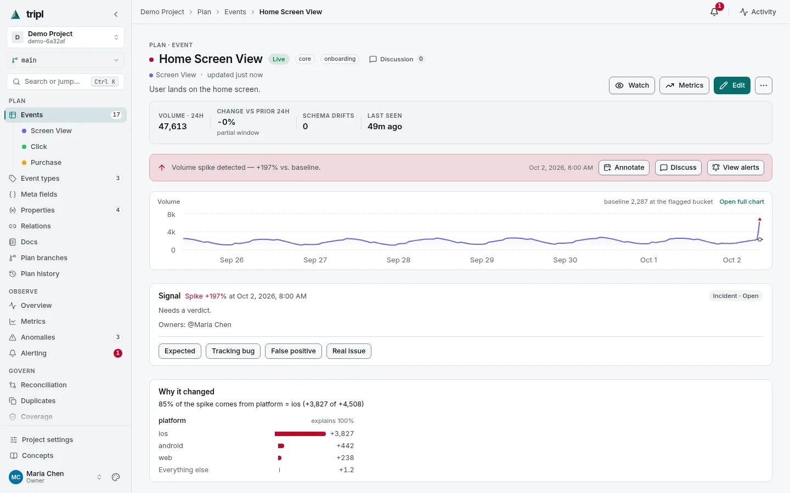
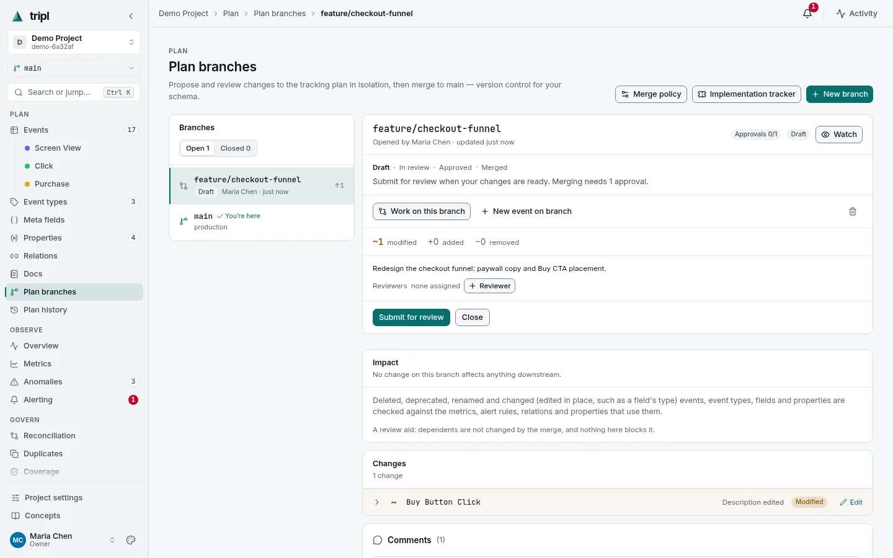
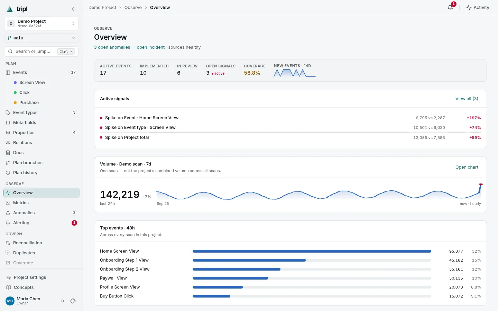
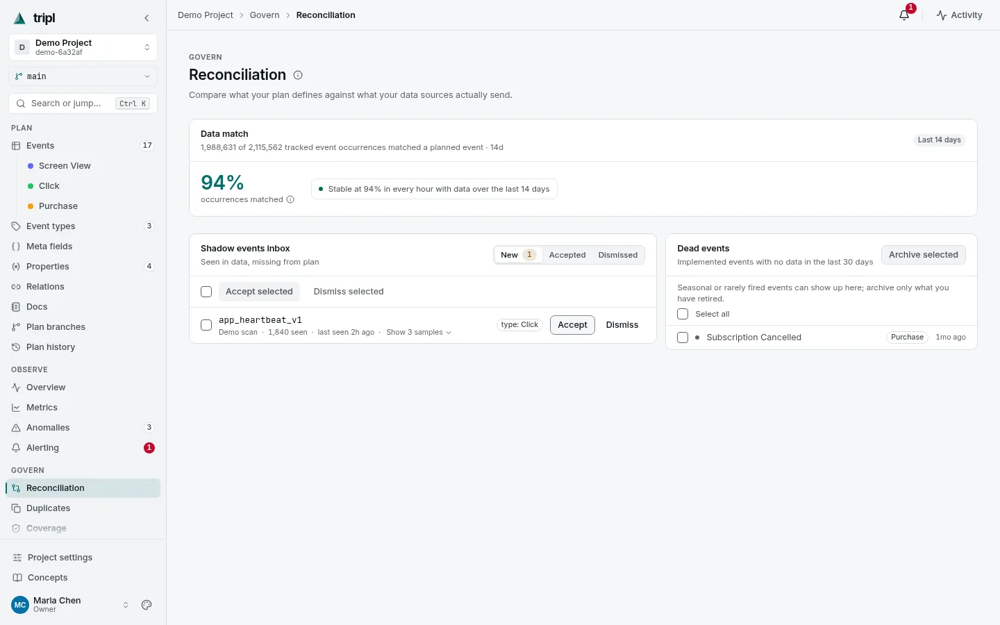

# Tripl

<p align="center">
  
</p>

<p align="center"><strong>Keep your product analytics honest.</strong></p>

<p align="center">
  <a href="https://vladenisov.github.io/tripl/">Docs</a> ·
  <a href="website/docs/quick-start.md">Quick start</a> ·
  <a href="website/docs/use/demo-workspace.md">Try the demo</a>
</p>

<picture>
  <source media="(prefers-color-scheme: dark)" srcset="website/static/img/screenshots/event-monitoring.dark.webp" />
  
</picture>
<p align="center"><sub>A volume spike on one event, attributed to the slice that caused it.</sub></p>

---

tripl keeps your **tracking plan** — the events, fields, and values your
product is supposed to send — and checks it continuously against the events
that actually land in your warehouse. When the two diverge, it tells you.

- **Plan as code.** One catalog for every event, field, and value; changes are
  made on branches, reviewed, and merged.
- **Checked against real data.** Scans read your warehouse tables and propose
  events and fields; reconciliation flags what is undocumented and what stopped
  arriving.
- **Anomalies with a cause.** Seasonal baselines per event, schema and value
  drift, release regressions — each signal broken down by the slice that moved.
- **Alerts where your team works.** Slack, Telegram, email, webhooks, Jira,
  Linear.

**No SDK.** tripl reads from the warehouse you already have — **ClickHouse**,
**BigQuery**, or **PostgreSQL** — and never writes to it.

Built for product managers, analysts, and data engineers who own a tracking
plan.

---

## Quick start

```bash
cp .env.example .env
docker compose -f compose.dev.yaml up --build
```

Open <http://localhost:5173>, create the first account, and click **Generate
demo project**. No warehouse is needed: the demo builds a project with events,
fields, a week of metrics, and a few anomalies, backed by a local synthetic
warehouse. Scans, metric collection, anomaly detection, and reconciliation run
against it for real ([what is synthetic](website/docs/use/demo-workspace.md)).

To use your own data, add a warehouse under **Settings → Data sources** and
follow the **[Quick Start guide](website/docs/quick-start.md)**.

| Local dev stack | URL |
|---|---|
| App | http://localhost:5173 |
| API | http://localhost:8000 |
| API reference (interactive) | http://localhost:8000/docs |

---

## What's inside

tripl is organised around three jobs: **Plan**, **Observe**, and **Govern**.

<table>
  <tr>
    <td width="33%" valign="top">
      <picture>
        <source media="(prefers-color-scheme: dark)" srcset="website/static/img/screenshots/branches.dark.webp" />
        
      </picture>
      <p><strong>📐 Plan</strong><br/>Every event, field, and value in one searchable catalog. Changes go on a <em>branch</em> and are reviewed before they merge, like a pull request for your tracking plan.</p>
    </td>
    <td width="33%" valign="top">
      <picture>
        <source media="(prefers-color-scheme: dark)" srcset="website/static/img/screenshots/overview.dark.webp" />
        
      </picture>
      <p><strong>📊 Observe</strong><br/>Anomaly detection that learns each event's daily and weekly rhythm, plus schema drift, release regressions, and a metrics catalog. Every signal shows <em>which slice</em> of the data moved.</p>
    </td>
    <td width="33%" valign="top">
      <picture>
        <source media="(prefers-color-scheme: dark)" srcset="website/static/img/screenshots/reconciliation.dark.webp" />
        
      </picture>
      <p><strong>🛡️ Govern</strong><br/>Reconciliation answers two questions: <em>what's documented but no longer arriving</em>, and <em>what's arriving but was never documented</em>. Coverage, an audit log, and roles round it out.</p>
    </td>
  </tr>
</table>

**Automation.** Scoped, revocable API keys; a CLI (`pip install tripl`); and an
MCP server (`tripl-mcp`) through which an LLM agent can search the plan and
propose changes on a branch.

See [Concepts](website/docs/use/concepts.md) for how the pieces fit together.

---

## Deployment

The default `compose.yaml` runs the published release image: set your secrets,
run `docker compose up -d`, and the app comes up on `:8000`. The
**[deployment guide](website/docs/run/deployment.md)** covers the rest, and
cutting a release is one command, `bin/release.sh` (see the
**[release process](website/docs/run/release.md)**).

---

## Documentation

📖 The full documentation lives at **[vladenisov.github.io/tripl](https://vladenisov.github.io/tripl/)**
(sources under [`website/docs/`](website/docs)). Good places to start:

- **[Quick Start](website/docs/quick-start.md)** — from `docker compose up` to
  a scanned plan, your own metrics, and a first alert.
- **[Concepts](website/docs/use/concepts.md)** — tracking plans, events,
  branches, and monitors, in plain language.
- **[User guide](website/docs/use/user-guide.md)** — a hands-on walkthrough from
  your first project to a working alert.
- **[Variables & templates](website/docs/use/variables-and-templates.md)** —
  documented values, source bindings, per-event overrides, and value drift.
- **[Agent & API guide](website/docs/integrate/agent-api-guide.md)** — letting an
  LLM agent or a script read and update the plan.

---

## Contributing

tripl is a FastAPI + PostgreSQL backend, a Celery worker that talks to your
warehouses, and a React frontend, all runnable locally with Docker Compose.

- **[CONTRIBUTING.md](CONTRIBUTING.md)** — local setup and commands. The root
  `Makefile` collects the common ones; run `make` to list them.
- **[Architecture](website/docs/develop/architecture.md)** — how the system is
  built, and why.
- **[AGENTS.md](AGENTS.md)** — a navigation map of the repo for coding agents.
